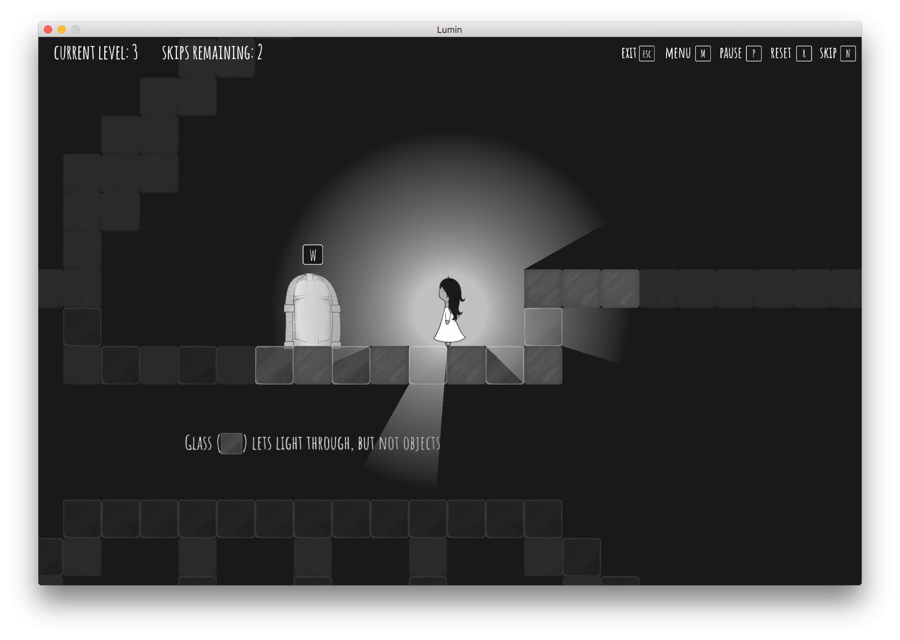

# Lumin

A light-based puzzle platformer game.




## Requirements

- CMake
- GLFW
- SDL

```
brew install pkg-config glfw3 sdl2 sdl2_mixer freetype
```

## Miscellaneous

The music is _[Underwater Theme](https://opengameart.org/content/underwater-theme)_ by CleytonKauffman.
